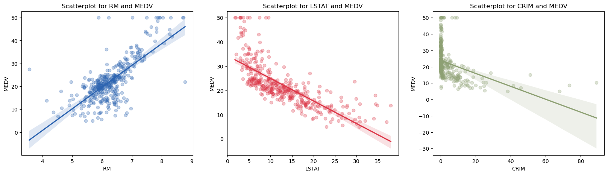
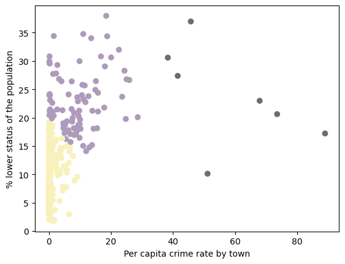

# Medium value of owner-occupied homes in Boston 
Exploratory analysis and comparison of prediction models
## Python
### Project Overview
This exploratory data analysis project aims to provide insight into the various factors influencing the medium value of owner-occupied homes (MEDV) in Boston. Also, different prediction models, including supervised learning models and a simple neural network, are tested and compared.

The main focus lies on the following variables:  
**CRIM:** per capita crime rate by town  
**RM:** average number of rooms per dwelling  
**DIS:** weighted distances to five Boston employment centres  
**LSTAT:** % lower status of the population

The analysis can answer key questions such as:
- Which variables have the greatest influence on MEDV?
- Which variables correlate positively and which negatively with MEDV?
- To what extent do the districts differ? What are the key separating features?

### Data Sources
The used data set is from the StatLib-Archive of Carnegie Mellon University and contains 506 entries, with each entry describing a suburb in Boston. It was originally
published in 1978 by Harrison, D. and Rubinfeld, D.L. in "Hedonic prices and the demand for clean air“.  
[more information](http://lib.stat.cmu.edu/datasets/boston)

### Tools
- Python
- Jupyter notebook


### Data Analysis
Some interesting code worked with:
```
cor_spearman = df.corr(method = "spearman")

cor_1 = cor_spearman["MEDV"].sort_values(ascending=False)

print(cor_1)
```
```
columns = ["RM", "LSTAT", "CRIM"]
y = "MEDV"

fig, axs = plt.subplots(nrows = 1, ncols=3, figsize=(20, 5))
colors = ["red", "green", "blue"]

for i, (column, color) in enumerate(zip(columns, colors)):
    sns.regplot(x=df[column], y=df[y], ax=axs[i], scatter_kws={"alpha": 0.3}, color = color)
    axs[i].set_title(f"Scatterplot for {column} and {y}")

plt.show()
```
```
#The NN_ReLU class inherits properties from nn.Module
class Net(nn.Module):
    def __init__(self, input_size, output_size):
        #super()-methode executes the heritage
        super(Net, self).__init__()
        self.fc1 = nn.Linear(input_size, 300)
        self.relu = nn.ReLU()
        self.fc2 = nn.Linear(300, output_size)

    def forward(self, x):
        x = self.fc1(x)
        x = self.relu(x)
        x = self.fc2(x)
        return x
```

### Comparison of the prediction models
When comparing the models, it is noticeable that the supervised learning models (multiple linear regression/ k-nearest neighbours/ decision tree) have similar mean square errors, from approx. 0.015 to 0.018. The unsupervised learning model, feedforward neural network, delivers better results. Here, the mean square error is only approx. 0.0059 for the scaled target values between 0 and 1.

To further evaluate the performance, I also looked at the coefficient of determination (R²), as this is a regression analysis and the coefficient of determination shows the relationship between the regression scatter and the total scatter of the measured data. The values for the coefficient of determinationnimmt (R²) lie between 0 and 1. The closer the value is to 1, the better the regression model fits the measured data. Here, too, it can be seen that the R² value of the NN, at approx. 0.85, is significantly higher than that of the other models.

### Insights on housing prices in Boston
When looking at the exploratory data analysis, it is first noticeable that among the variables examined in more detail - MEDV, LSTAT, CRIM and DIS - it is primarily the crime rate that scatters the most, which might be due to the many outliers. The correlation analysis shows that there is a particularly strong positive correlation between the proportion of residential land zoned for lots over 25,000 sq.ft and the number of rooms per dwelling in relation to the owner-occupied homes. In contrast, high crime rates, low status and also property tax and a high proportion of non-retail business acres per town have a particularly negative impact on housing prices in Boston. Further, the following scatter plots confirm a negative correlation between MEDV and LSTAT and CRIM, whereas the average number of rooms per dwelling tends to have a positive effect on MEDV.



Clustering was used to divide the data into three clusters, displaying differences regarding economic status & accessibility (CRIM, LSTAT and DIS). The clearest separation of the clusters can be seen in the comparison of the crime rate and the proportion of the population with low status.




### Feedback

If you encounter any issues, mistakes, or have suggestions for improvement, please let me know.
